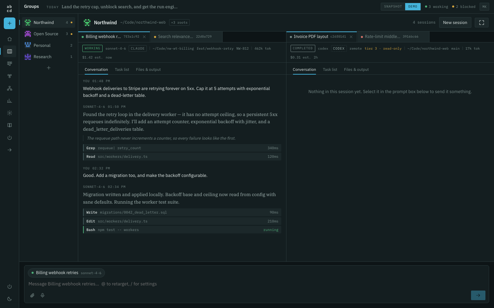
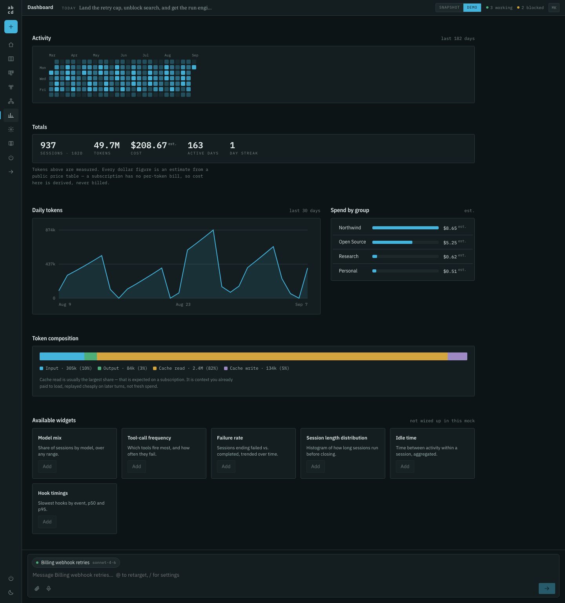
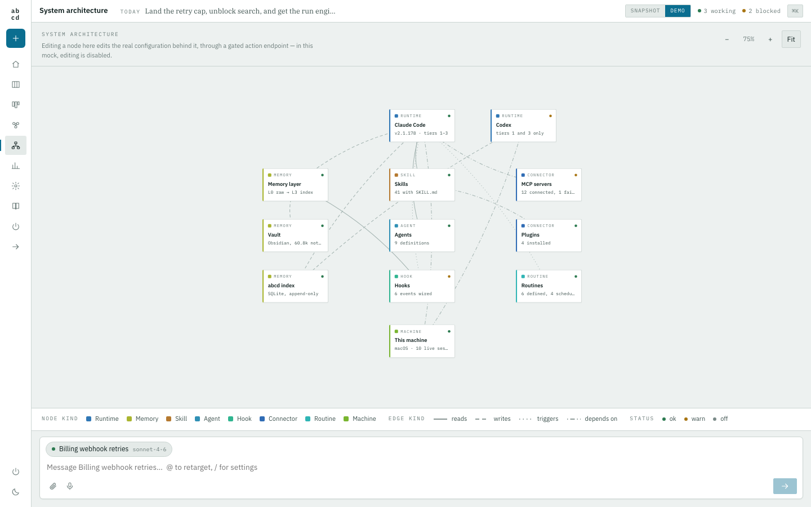
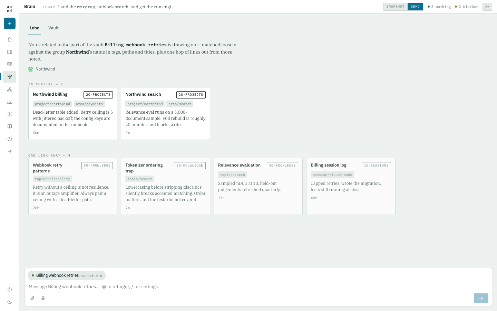

# abcd


**Build your own AI harness.**

`abcd-efgh-ijkl-mnop-qrst-uvwx-yz` — an open-source desktop app for running many
Claude Code sessions at once, and for owning the system underneath them: memory
layers, skills, connectors, architecture, and the brain they all read from.

> **Status: pre-alpha.** Phases 0–6 are built. The run engine spawns and streams
> real sessions and the permission gate is enforced, but the app is young and the
> desktop build is unsigned. See [Roadmap](#roadmap).

---



**Columns are groups. Every tab is a session.** A group binds to a primary
filesystem root, but assignment is content-first, because on a real machine most
sessions start from `$HOME` and the working directory tells you nothing. Each
session shows its model, its reachability tier, its tokens and its cost —
labelled **measured** when the runtime reported it and **est.** when abcd
derived it, because those are not the same thing.

---

## Why another one of these

There are already several good tools that run parallel Claude Code agents in git worktrees and show you a
diff — Conductor, Nimbalyst, Claude Squad, vibe-kanban, opcode. If that is what you need, use one of them.

abcd is a different shape. In those tools the unit is a **task**. In abcd the unit is **your system**:

- Your **groups** bind to real filesystem roots, because a theme spans repositories.
- Your **brain** is a tab, so you can see which part of it a session is actually using.
- Your **system architecture** — memory, skills, hooks, connectors, routines — is an editable canvas, not a
  pile of dotfiles you edit blind.
- Your **day** has a beginning and an end. Opening abcd sets an objective; closing it winds every session
  down and reconciles what actually happened.

A session is one tab inside that. Not the whole product.



## What works today

| | |
|---|---|
| Ten surfaces, both themes | ✅ |
| Reading your real sessions, settings, skills, hooks and vault | ✅ |
| History index that outlives Claude Code's own retention | ✅ |
| Spawning, streaming, interrupting, resuming and forking sessions | ✅ |
| Permission gate — fails closed, snapshots, reverts by sha256 | ✅ |
| Codex as a second runtime (history; spawn when installed) | ✅ |
| Writing your `settings.json` — allowlisted, snapshotted, revertible | ✅ |
| Desktop app (macOS DMG) | ✅ unsigned |
| Writing into sessions abcd did not start | ❌ [not possible](#what-abcd-cannot-do) |
| Linux and Windows | ❌ abstracted, unverified |

## Run it

```bash
git clone https://github.com/sboghossian/abcd-efgh-ijkl-mnop-qrst-uvwx-yz.git abcd
cd abcd
npm install
npm run dev        # http://localhost:4488
```

Node 20+. No configuration, no keys, no account. The app boots into `DEMO=1` synthetic data, so it is never
an empty window and never contains anyone's real information.

> **macOS + iCloud note.** If you clone into an iCloud-synced folder (`~/Documents`, `~/Desktop`),
> symlink `node_modules` somewhere outside it. Native binaries in iCloud get evicted and conflict-copied,
> which breaks builds in ways that are hard to diagnose.

## Running it on your own setup

Two ways, depending on how live you want it.

**Live (Phase 1).** Run the core server alongside the UI and abcd reads your real
sessions continuously, refreshing every 15 seconds:

```bash
npm run core     # http://127.0.0.1:4499  — read-only, localhost only
npm run dev      # http://localhost:4488  — a CORE / SNAPSHOT / DEMO toggle appears
```

The server binds `127.0.0.1` only, answers `GET` only, validates every path it
reads as being under `$HOME`, and appends every request to `~/.abcd/audit.log`.
There is no action endpoint in this phase; a `POST` is refused with a 405.

It also maintains **the history index** at `~/.abcd/index.db` (via `node:sqlite`,
so no native dependency and nothing to compile). Claude Code retains roughly two
and a half weeks of transcripts and prunes the rest, so a month, quarter or year
cannot be built from its data. The index starts filling the first time you run
the server, and it is the one thing that cannot be backfilled: every day it does
not exist is a day permanently missing. If you point abcd at an Obsidian vault
holding a session archive, older days are recovered from it once and marked as
vault-sourced so they are never confused with days abcd observed itself.

**Snapshot (no server).** A one-shot fixture instead:


The app boots on synthetic data. To click through your *real* sessions instead:

```bash
cp scripts/paths.local.example.json scripts/paths.local.json   # point it at your vault (optional)
npm run snapshot                                                # reads ~/.claude, writes a local fixture
npm run dev                                                     # a LIVE / DEMO toggle appears top-right
```

`npm run snapshot` reads your own machine and writes `src/fixtures/live.local.ts`.
**That file is gitignored and must stay that way** — it contains real transcript text,
file paths and vault excerpts. Everything committed here is synthetic.

The generator is bounded on purpose: the session list is capped by recency, every
transcript is byte-capped (transcripts of 16 MB exist), and the vault is sampled
rather than walked, because a knowledge folder can hold tens of thousands of files
and walking an iCloud tree hangs on evicted ones.

Optional: `scripts/group-rules.local.json` overrides how sessions are grouped.

```json
[["Work", "acme|TICKET-\\d"], ["Notes", "obsidian|vault"]]
```

Worth knowing before you look at the numbers: cost is **estimated** from a public
price table applied to observed tokens. On a subscription there is no per-token
bill, so the figure is derived, never billed. Cache reads typically dominate the
token count and that is normal.



The **system architecture** canvas is your own harness read off disk: memory
layers, skills, agents, hooks, connectors, routines, runtimes — with the edges
that actually connect them.



The **brain** answers "which part of my notes is this session drawing on",
rather than making you open a second app. Backlinks are read from the
pre-computed footers your vault already has; nothing is recomputed.

## Desktop app

```bash
npm run build          # the renderer
npm run desktop        # run the shell against it
npm run dist           # package a DMG into release/
```

The shell is deliberately thin. It owns a window, a tray, keep-awake, and
nothing else — `core/` runs as a **sidecar process**, not inside Electron.

That is a correctness requirement, not tidiness. Electron bundles its own Node
(Electron 33 ships Node 20.18) and the history index uses `node:sqlite`, which
needs Node 22.5+. Mounting core inside the shell would couple the index to
whichever Node the shell happens to ship, and re-couple it on every Electron
upgrade. As a sidecar the two are independent, a core crash cannot take the
window down, and swapping Electron for Tauri is a shell swap rather than a
rewrite. A lint rule enforces the boundary:

```bash
npm run lint:core      # fails if anything in core/ imports Electron
```

The cost, stated plainly: **abcd needs Node 22.5+ on your PATH.** It already
needs the `claude` CLI, so this is not a new class of dependency, but it is
one. Point abcd at a specific Node with `ABCD_NODE=/path/to/node`. Without a
suitable Node the app still opens and says so, showing synthetic data.

### Signing

The build is **unsigned**. Producing a signed, notarised artifact needs
credentials only the project owner has:

* **macOS** — a paid Apple Developer account and a *Developer ID Application*
  certificate in your keychain. Then:

  ```bash
  export APPLE_ID="you@example.com"
  export APPLE_APP_SPECIFIC_PASSWORD="xxxx-xxxx-xxxx-xxxx"
  export APPLE_TEAM_ID="XXXXXXXXXX"
  npm run dist                       # signs and notarises
  ```

  `build/entitlements.mac.plist` already grants what the hardened runtime needs
  to spawn the `claude` CLI.

* **Windows** — an Authenticode certificate from a recognised CA.
* **Linux** — nothing; an unsigned AppImage is normal.

Until then macOS Gatekeeper will refuse the app on another machine. That is
correct behaviour, not a bug in the build.

## How it reaches Claude Code

Three tiers, because a session's reachability depends on how it was born.

| Tier | Sessions | Mechanism | Reach |
|---|---|---|---|
| **1 — Owned** | Started by abcd | `claude -p --output-format stream-json` | Full: send, stream, interrupt, resume, fork |
| **2 — Foreign** | Started in your editor or terminal | Unix socket from `~/.claude/sessions/<pid>.json` | Send into a session abcd did not start |
| **3 — Fallback** | Anything else | Reading `*.jsonl` transcripts | Observe only |

Tier 2 uses private, undocumented IPC. abcd pins the versions it has verified and drops to tier 3 on
anything else, with a visible banner. It will never silently pretend a message was delivered.

**Codex** is supported at tiers 1 and 3 only — it has no session registry, so it cannot receive broadcasts,
and the harness surfaces do not apply to it. The UI says so rather than showing you a broken panel.

## Design rules

Carried from the spec, enforced in review:

- Four typeface roles, never mixed outside role. Mono for **every** datum.
- The accent colour is a **verb**: active state and primary action only.
- One dominant region per screen. No gradients. No emoji in the UI.
- **Tokens are measured; dollars are estimated.** A subscription has no per-token bill, so every currency
  figure carries the word "est." Presenting an estimate as spend is how a tool loses trust.
- Status is **derived**, never authored. You cannot drag a session into "done".

## Privacy

Local-first, and that is the whole design, not a setting.

- Binds to `127.0.0.1`. Any remote surface is hard-blocked to read-only.
- Every filesystem path is validated as being under `$HOME`.
- Append-only audit log of every settled action and outbound call.
- Incognito sessions write **nothing**: no transcript, no memory, no vault capture.
- Dictation runs on local `whisper.cpp`. Audio never leaves the machine.
- Telemetry is off, and there is nothing to turn on yet.

## What abcd cannot do

Worth stating plainly, because the gap looks like a missing feature and is not one.

abcd fully controls sessions it starts. It **discovers** sessions started
elsewhere, names them, and tells you why each is or is not reachable. It cannot
**write into** one.

That is a property of the platform, not a gap in this build. Every supported
interface was checked:

| Interface | Why it does not work |
|---|---|
| `SendMessage` / `ListAgents` | Internal to an agent's own tool loop. No external API. |
| Peer inbox socket | The transport is documented; the message schema is not, and it is built for a session's own child processes. |
| Channels | Must be opted in **at launch** with `--channels`, from an allowlist. Cannot be retrofitted into a running session. |

So abcd reports reach honestly and routes real work through runs it owns. A tool
that claimed otherwise would be guessing a wire format and writing it into your
live work.

## Roadmap

| Phase | | |
|---|---|---|
| 0 | Clickable front end on synthetic data | ✅ |
| 1 | Read-only truth — real sessions, transcripts, settings, history index | ✅ |
| 2 | The run engine — spawn, stream, interrupt, resume, fork, permission gates | ✅ |
| 3 | Reach and the day — tiers, broadcast, wind-down, Codex adapter | ✅ |
| 4 | Harness surfaces on real data, and guarded settings writes | ✅ |
| 5 | Packaging — Electron shell, core as a sidecar, macOS DMG | ✅ unsigned |
| 6 | Linux, then Windows | abstracted, unverified |

Phase 1 shipped the history index before anything else, because Claude Code
retains roughly two and a half weeks of transcripts. History is the one thing
that cannot be backfilled — every day the index does not exist is a day
permanently missing.

Phase 2 was the whole product. Every prior attempt at this idea visualised state
that already existed on disk. Running a live agent is the part that had never
been finished.

## Contributing

Not yet — the architecture is still moving. Issues and opinions are welcome.

The one structural rule, enforced by lint: **`packages/core` imports nothing from Electron.** The shell is
thin and swappable. If the memory cost of many always-on sessions bites, moving to Tauri should be a shell
swap, not a rewrite.

## Licence

[AGPL-3.0](LICENSE). Chosen deliberately. A well-liked MIT tool in this exact category was deprecated and
its users routed to a paid closed-source successor. AGPL makes that specific outcome impossible here.
